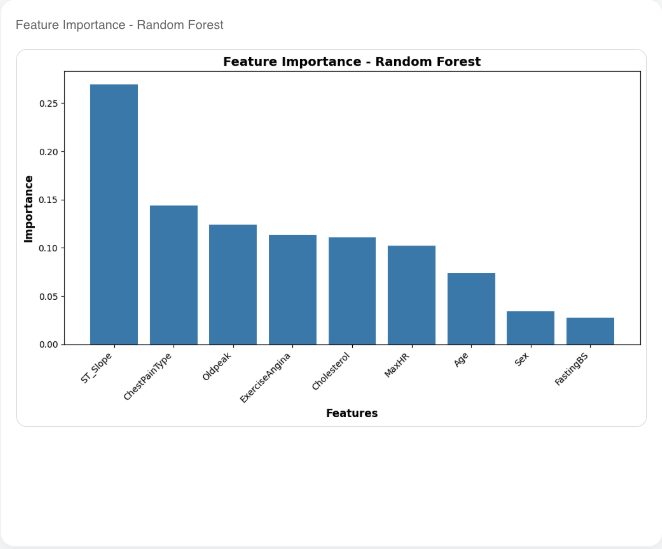
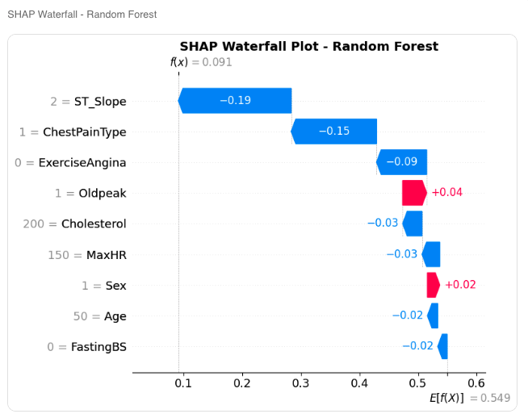
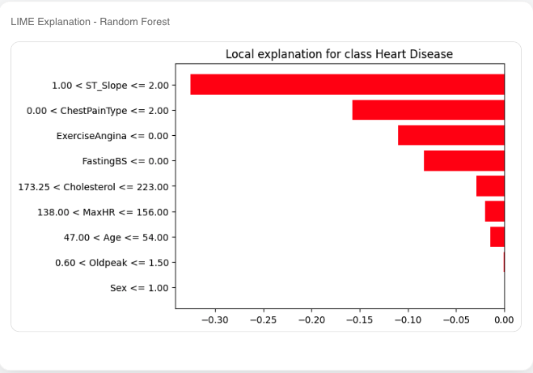
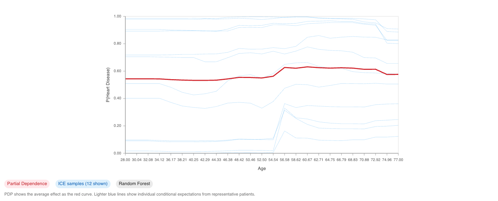
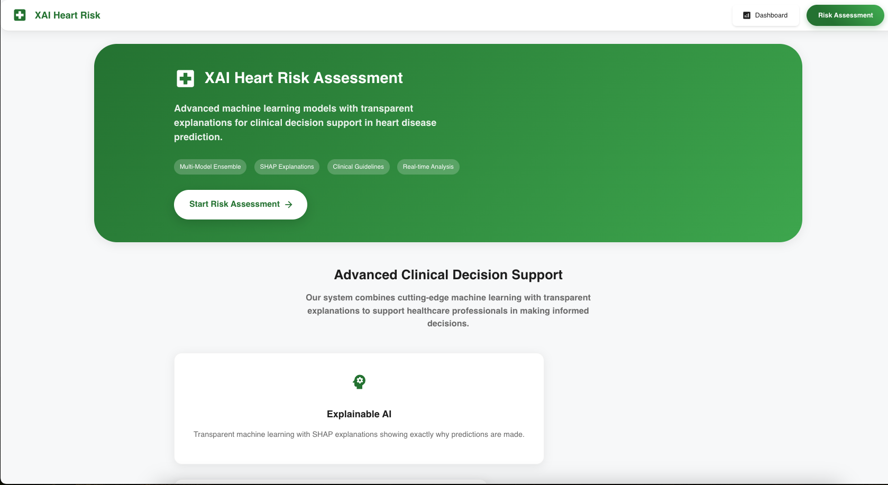

## Heart Risk Prediction Web App

An end-to-end machine learning web application for **heart disease risk prediction** with **explainable AI (XAI)**.  
The backend serves multiple models (Random Forest, XGBoost, Neural Network) with SHAP and LIME explanations, while the frontend provides a modern React UI for clinicians and users.

### Screenshots & Visuals

- **Feature importance**  
  

- **SHAP explanation example**  
  

- **LIME explanation example**  
  

- **PDP/ICE explorer**  
  

- **Web app UI**  
  

### Project Structure

- **backend**: Flask API exposing prediction, explanation, PDP/ICE, and audit endpoints, loading pre-trained models and encoders.
- **backend/machine_learning**: Notebooks, training code, data (`heart.csv`), encoders, and saved models.
- **frontend**: React + Vite + TypeScript SPA for collecting patient data and visualising predictions and explanations.
<!-- - **DATA_PREPROCESSING.md**: Detailed description of the data cleaning, encoding, feature selection, and splitting pipeline.
- **TECHNICAL_CHALLENGES.md**: Notes on XGBoost/SHAP compatibility issues and the implemented workarounds. -->

### Backend Overview

- **Framework**: Flask + Flask-CORS.
- **Models**:
  - Random Forest (`best_model.pkl`)
  - XGBoost (`best_xgb.json`)
  - Neural Network (`model_nn.keras`)
- **Key API endpoints**:
  - `POST /api/predict`: Given patient features, returns:
    - Per-model predictions and probabilities
    - Aggregated risk category (Low / Moderate / High)
    - Model agreement score
    - Audit logging to `audit_log.jsonl`
  - `POST /api/explain`: Returns SHAP and LIME plots and feature contributions for a single instance.
  - `POST /api/pdp`: Returns Partial Dependence and ICE data for a given feature and model.
  - `GET /api/audit`: Returns simple analytics over the audit log.

Input features used for prediction:

- Age, Sex, ChestPainType, Cholesterol, FastingBS, MaxHR, ExerciseAngina, Oldpeak, ST_Slope  

### Frontend Overview

- **Stack**: React 19, React Router, Vite, TypeScript, MUI, Tailwind.
- **Key pages**:
  - `Home`: Project overview and navigation.
  - `Predict`: Form to enter patient features, call the backend, and display:
    - Risk prediction
    - Model probabilities
    - Explanation plots and contribution tables (via `/api/explain` and `/api/pdp`).

## Getting Started

### Prerequisites

- **Python**: 3.10+ recommended
- **Node.js**: 20+ recommended
- **Package managers**:
  - `pip` for Python dependencies
  - `npm` (or `pnpm`/`yarn`) for frontend dependencies

### 1. Backend Setup (Flask API)

From the project root:

```bash
cd backend

# Optional but recommended: create a virtual environment
python -m venv .venv
source .venv/bin/activate  # On Windows: .venv\Scripts\activate

# Install dependencies (approximate list)
pip install \
  flask flask-cors \
  joblib numpy pandas shap matplotlib \
  keras tensorflow \
  lime xgboost
```

Make sure the following files exist (from model training):

- `machine_learning/models/best_model.pkl`
- `machine_learning/models/best_xgb.json`
- `machine_learning/models/model_nn.keras`
- `machine_learning/encoders/sex_encoder.pkl`
- `machine_learning/encoders/chestpain_encoder.pkl`
- `machine_learning/encoders/exercise_encoder.pkl`
- `machine_learning/encoders/slope_encoder.pkl`

Run the backend:

```bash
cd backend
python app.py
```

By default the API will run on **`http://localhost:5000`**.

### 2. Frontend Setup (React + Vite)

From the project root:

```bash
cd frontend
npm install
```

Start the development server:

```bash
npm run dev
```

Vite will print the local dev URL, typically **`http://localhost:5173`**.  
Ensure the frontend is configured to call the backend at `http://localhost:5000` (see `src/services/api.tsx`).

### 3. Running the Full App

1. **Terminal 1** – start the Flask backend:
   - `cd backend`
   - Activate virtualenv (if used)
   - `python app.py`
2. **Terminal 2** – start the React frontend:
   - `cd frontend`
   - `npm run dev`
3. Open the frontend URL in your browser (e.g. `http://localhost:5173`) and submit patient details from the Predict page.

## Testing & Linting

- **Frontend lint**:

  ```bash
  cd frontend
  npm run lint
  ```
